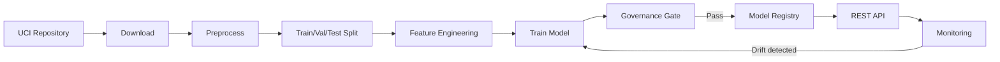
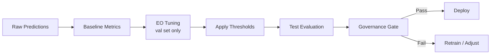

# Fairness-Aware Candidate Pre-Screening

A production-grade machine learning pipeline for fair candidate pre-screening with bias mitigation. This project demonstrates best practices for fairness-aware ML, including proper evaluation protocols, model persistence, and deployment interfaces.

## Overview

This project investigates **fairness in an automated hiring pre-screening system** using the Adult (Census Income) dataset. We simulate a company that uses ML to identify candidates likely to have higher earning potential:

- Candidates predicted `>50K` are **fast-tracked for interviews**
- Candidates predicted `<=50K` are **deprioritized**

If the model systematically underestimates certain groups, this creates unfair barriers to opportunity.

## Key Features

- **Leakage-free evaluation**: EO thresholds tuned on validation, evaluated on test
- **Multiple fairness metrics**: SPD, DI, TPR Gap, Equalized Odds
- **Model registry**: Save, load, and manage trained models
- **CLI interface**: Easy-to-use command-line tools
- **API deployment**: FastAPI with Docker support
- **Drift monitoring**: Track data and fairness drift over time

## Quick Start

### Installation

```bash
# Clone the repository
git clone https://github.com/VillafuerTech/fairness-project.git
cd fairness-project

# Install the package
pip install -e "."

# For development
pip install -e ".[dev]"

# For API deployment
pip install -e ".[api]"
```

### Run the Pipeline

```bash
# Set PYTHONPATH (required for legacy scripts)
export PYTHONPATH=src:.

# Run the unified pipeline (baseline + EO post-processing)
python src/main.py

# Or run with specific step
python src/main.py --step 1        # Baseline only
python src/main.py --step 2        # EO post-processing only
python src/main.py --step all      # Both (default)

# Run leakage-free evaluation (recommended)
python src/main_leakage_free.py
```

### CLI Commands

```bash
# Using the CLI (requires pip install -e .)
PYTHONPATH=src python -m fairness_project.cli train --model xgb --seed 42
PYTHONPATH=src python -m fairness_project.cli evaluate
PYTHONPATH=src python -m fairness_project.cli mitigate eo --sensitive sex
PYTHONPATH=src python -m fairness_project.cli plot
```

### Developer Workflow

The recommended CLI-first pipeline from data to deployment:

```bash
# 1. Download and preprocess data
fairness data download
fairness data preprocess

# 2. Train a model
fairness train --model xgb --seed 42

# 3. Evaluate performance and fairness
fairness evaluate

# 4. Run governance gate (pass required before deployment)
python -m fairness_project.governance.gate --report data/metrics/report.json

# 5. Deploy the API
MODEL_PATH=models/model.joblib uvicorn fairness_project.inference.api:app --port 8000
```

## Project Structure

```
fairness-project/
├── pyproject.toml                 # Package configuration (PEP 621)
├── configs/
│   └── default.yaml               # Default configuration
├── data/
│   ├── raw/adult/                 # Raw UCI Adult data
│   ├── processed/adult/           # Processed data
│   ├── predictions/               # Model predictions
│   ├── metrics/                   # Evaluation metrics
│   └── plots/                     # Visualizations
├── docs/
│   ├── data.md                    # Data documentation
│   ├── responsible_ai.md          # Responsible AI protocol
│   └── model_card.md              # Model card
├── src/
│   ├── main.py                    # Unified pipeline (legacy)
│   ├── main_leakage_free.py       # Leakage-free evaluation
│   ├── preprocessing/             # Feature preprocessing
│   ├── models/                    # Model training
│   ├── metrics/                   # Fairness metrics
│   ├── techniques/                # Mitigation techniques
│   ├── plots/                     # Visualization
│   └── fairness_project/          # Core package
│       ├── cli.py                 # CLI interface
│       ├── config.py              # Configuration system
│       ├── data/                  # Data download/preprocess
│       ├── features/              # Feature engineering
│       ├── models/                # Model training & registry
│       ├── metrics/               # Performance & fairness
│       ├── fairness/              # Mitigation techniques
│       ├── evaluation/            # Evaluation & reporting
│       ├── inference/             # Batch & API inference
│       └── monitoring/            # Drift detection
├── tests/                         # Unit tests
├── .github/workflows/ci.yml       # CI pipeline
├── Dockerfile                     # API container
└── docker-compose.yml             # Docker setup
```

## System Architecture

### Data Flow Pipeline



### Fairness Pipeline



## Evaluation Protocol

### Leakage-Free EO Tuning

The Equal Opportunity post-processing requires threshold tuning. To prevent test set leakage:

1. **Split data**: Train / Validation (15%) / Test
2. **Train model**: On training set only
3. **Tune thresholds**: On validation set only
4. **Evaluate**: On test set (thresholds applied without using test labels)

```python
# Example using leakage-free protocol
from fairness_project.evaluation.leakage_free import LeakageFreeEvaluator

evaluator = LeakageFreeEvaluator(sensitive_col="sex")
evaluator.tune_thresholds_on_validation(y_val, y_proba_val, sensitive_val)
y_pred_test = evaluator.apply_to_test(y_proba_test, sensitive_test)
```

## Fairness Metrics

| Metric | Description | Ideal Value |
|--------|-------------|-------------|
| SPD | Statistical Parity Difference | 0 |
| DI | Disparate Impact | 1 |
| TPR Gap | True Positive Rate Gap | 0 |

## Results

### Before EO Post-Processing

| Model | Accuracy | SPD | DI | TPR Gap |
|-------|----------|-----|-----|---------|
| LR | 0.847 | 0.175 | 0.321 | 0.070 |
| RF | 0.845 | 0.181 | 0.339 | 0.066 |
| XGB | 0.862 | 0.170 | 0.345 | 0.065 |

### After EO Post-Processing (Leakage-Free)

| Model | Accuracy | SPD | DI | TPR Gap |
|-------|----------|-----|-----|---------|
| LR | 0.846 | 0.150 | 0.417 | -0.020 |
| RF | 0.843 | 0.152 | 0.441 | -0.038 |
| XGB | 0.859 | 0.158 | 0.455 | -0.015 |

## API Deployment

### Using Docker

```bash
# Build and run
docker build -t fairness-api .
docker run -p 8000:8000 -v ./models:/app/models fairness-api

# Or with docker-compose
docker-compose up
```

### API Endpoints

Interactive API docs are available at [`/docs`](http://localhost:8000/docs) (Swagger UI) and [`/redoc`](http://localhost:8000/redoc) (ReDoc).

```bash
# Health check
curl http://localhost:8000/health

# Model metadata and fairness metrics
curl http://localhost:8000/v1/metadata

# Single prediction
curl -X POST http://localhost:8000/v1/predict \
  -H "Content-Type: application/json" \
  -d '{
    "age": 35,
    "workclass": "Private",
    "fnlwgt": 200000,
    "education": "Bachelors",
    "education_num": 13,
    "marital_status": "Married-civ-spouse",
    "occupation": "Exec-managerial",
    "relationship": "Husband",
    "native_country": "United-States",
    "capital_gain": 5000,
    "capital_loss": 0,
    "hours_per_week": 40
  }'
```

For the complete API reference, see [API Specification](docs/api_spec.md). For integration examples in Python, see the [API Integration notebook](notebooks/5_API_Integration_Examples.ipynb).

## Configuration

Configuration is managed via YAML files:

```yaml
# configs/default.yaml
seed: 42
model:
  model_type: xgb
  xgb_n_estimators: 300
fairness:
  sensitive_attributes: [sex, race_binary]
  eo_base_threshold: 0.5
```

## Testing

```bash
# Run tests (requires pytest)
pip install pytest
PYTHONPATH=src pytest tests/ -v
```

## Documentation

- [Data Documentation](docs/data.md) - Dataset details, licensing, and API input schema
- [API Specification](docs/api_spec.md) - Complete REST API reference
- [Governance Gate](docs/governance.md) - Pre-deployment fairness checks
- [Deployment Guide](docs/deployment.md) - Deployment and operations manual
- [Responsible AI Protocol](docs/responsible_ai.md) - Fairness guidelines
- [Model Card](docs/model_card.md) - Model specifications

## License

MIT License

## Citation

If using this project, please cite:

```bibtex
@misc{fairness-project,
  title={Fairness-Aware Candidate Pre-Screening},
  author={VillafuerTech},
  year={2024},
  url={https://github.com/VillafuerTech/fairness-project}
}
```

## Acknowledgments

- UCI Machine Learning Repository for the Adult dataset
- Trustworthy Machine Learning course project
