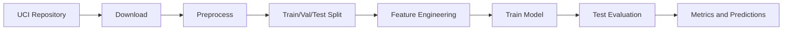
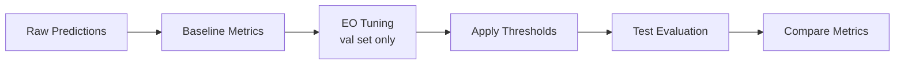

# Fairness-Aware Candidate Pre-Screening

An educational responsible-ML evaluation project that studies group fairness,
leakage-free threshold tuning, and local serving interfaces with the UCI Adult
dataset.

## Overview

This repository uses a hypothetical pre-screening scenario to make fairness
trade-offs concrete. The underlying task is Adult-dataset income classification;
the data contains census records, not job applications, and income is not a
measure of job qualification.

It implements baseline models and Equal Opportunity (EO) post-processing, then
compares performance and group-fairness metrics on a held-out test set.

> **Not for hiring decisions.** This is a course/research artifact, not a
> validated employment-selection system. Passing its configurable checks does
> not establish legal compliance, ethical acceptability, or real-world safety.

## Key Features

- **Leakage-free evaluation**: EO thresholds tuned on validation and evaluated
  on test
- **Multiple fairness metrics**: SPD, DI, TPR Gap, Equalized Odds
- **Reproducible artifacts**: Per-model prediction and metric CSV outputs
- **Data CLI**: Repeatable preprocessing command used by the quick start
- **Experimental policy check**: Fail-closed threshold checks for compatible
  JSON reports
- **API scaffold**: Versioned FastAPI routes covered by mock-based tests
- **Drift utilities**: Experimental data- and fairness-drift checks

## Quick Start

### Installation

```bash
git clone \
  https://github.com/VillaforTech/Fairness-Aware-Candidate-Pre-Screening.git
cd Fairness-Aware-Candidate-Pre-Screening

python -m venv .venv
source .venv/bin/activate
python -m pip install --upgrade pip
python -m pip install -e ".[dev,api]"
```

The automated test matrix covers Python 3.10, 3.11, and 3.12.

### Run the Pipeline

```bash
# Build the model-ready dataset from the bundled UCI files
fairness data preprocess

# Tune EO thresholds on validation data and evaluate once on test data
PYTHONPATH=src:. python src/main_leakage_free.py --seed 42

# Run the automated checks
pytest tests/ -q
```

## Project Structure

```text
Fairness-Aware-Candidate-Pre-Screening/
├── pyproject.toml                 # Package configuration (PEP 621)
├── configs/
│   └── default.yaml               # Default configuration
├── data/
│   ├── raw/adult/                 # Raw UCI Adult data
│   ├── processed/adult/           # Processed data
│   ├── predictions/               # Model predictions
│   ├── metrics/                   # Evaluation metrics
│   └── plots/                     # Visualizations
├── docs/
│   ├── data.md                    # Data documentation
│   ├── responsible_ai.md          # Responsible AI protocol
│   └── model_card.md              # Model card
├── src/
│   ├── main.py                    # Unified pipeline (legacy)
│   ├── main_leakage_free.py       # Leakage-free evaluation
│   ├── preprocessing/             # Feature preprocessing
│   ├── models/                    # Model training
│   ├── metrics/                   # Fairness metrics
│   ├── techniques/                # Mitigation techniques
│   ├── plots/                     # Visualization
│   └── fairness_project/          # Core package
│       ├── cli.py                 # CLI interface
│       ├── config.py              # Configuration system
│       ├── data/                  # Data download/preprocess
│       ├── features/              # Feature engineering
│       ├── metrics/               # Performance & fairness
│       ├── fairness/              # Mitigation techniques
│       ├── evaluation/            # Evaluation & reporting
│       ├── inference/             # Batch & API inference
│       └── monitoring/            # Drift detection
├── tests/                         # Unit tests
├── .github/workflows/ci.yml       # CI pipeline
├── Dockerfile                     # API container
└── docker-compose.yml             # Docker setup
```

## System Architecture

### Data Flow Pipeline



### Fairness Pipeline



## Evaluation Protocol

### Leakage-Free EO Tuning

The Equal Opportunity post-processing requires threshold tuning. To prevent
test-set leakage:

1. **Split data**: Train / Validation (15%) / Test
2. **Train model**: On training set only
3. **Tune thresholds**: On validation set only
4. **Evaluate**: On test set (thresholds applied without using test labels)

```python
# Example using leakage-free protocol
from fairness_project.evaluation.leakage_free import LeakageFreeEvaluator

evaluator = LeakageFreeEvaluator(sensitive_col="sex")
evaluator.tune_thresholds_on_validation(y_val, y_proba_val, sensitive_val)
y_pred_test = evaluator.apply_to_test(y_proba_test, sensitive_test)
```

## Fairness Metrics

| Metric | Description | Ideal Value |
|--------|-------------|-------------|
| SPD | Statistical Parity Difference | 0 |
| DI | Disparate Impact | 1 |
| TPR Gap | True Positive Rate Gap | 0 |

## Results

The following values were reproduced on 2026-08-28 with Python 3.11 and seed 42
using the documented leakage-free command. They describe this dataset and split;
they are not estimates of hiring validity or real-world impact.

### Before EO Post-Processing

| Model | Accuracy | SPD | DI | TPR Gap |
|-------|----------|-----|-----|---------|
| LR | 0.8477 | 0.1764 | 0.3180 | 0.0713 |
| RF | 0.8441 | 0.1790 | 0.3415 | 0.0691 |
| XGB | 0.8687 | 0.1760 | 0.3418 | 0.0584 |

### After EO Post-Processing (Leakage-Free)

| Model | Accuracy | SPD | DI | TPR Gap |
|-------|----------|-----|-----|---------|
| LR | 0.8471 | 0.1668 | 0.3550 | 0.0372 |
| RF | 0.8442 | 0.1731 | 0.3632 | 0.0421 |
| XGB | 0.8691 | 0.1666 | 0.3768 | 0.0117 |

All three EO-adjusted runs fail the default policy gate on disparate impact and
statistical parity. For example, XGBoost has `DI=0.3768` (required: at least
`0.80`) and `SPD=0.1666` (required absolute value: at most `0.10`). A lower TPR
gap does not make the model acceptable for use.

## Experimental Policy Check

The repository also includes a fail-closed threshold checker for compatible
JSON reports. CI tests that checker with fixed passing and failing fixtures. The
documented leakage-free pipeline does not currently create that JSON report or
invoke the checker automatically, so it is a separate experimental capability.

## API Scaffold Status

The request schemas, health endpoint, and prediction routes are covered by tests
that inject mock models. The bundled XGBoost artifact is **not compatible** with
the current 12-field API schema, so end-to-end prediction serving is not a
verified capability. The Docker files are retained as development scaffolding.

```bash
pytest tests/test_api.py -q
```

The intended interface contract is recorded in the
[API Specification](docs/api_spec.md), but it should not be treated as a working
deployment guide until a compatible artifact and an end-to-end test are added.

## Configuration

Configuration is managed via YAML files:

```yaml
# configs/default.yaml
seed: 42
model:
  model_type: xgb
  xgb_n_estimators: 300
fairness:
  sensitive_attributes: [sex, race_binary]
  eo_base_threshold: 0.5
```

The documented smoke run evaluates `sex`; `race_binary` is available in the
processed data but is not reported by that command.

## Testing

```bash
pytest tests/ -q
ruff check src/ tests/
ruff format --check src/ tests/
```

## Documentation

- [Data Documentation](docs/data.md) - Dataset details, licensing, and API schema
- [API Specification](docs/api_spec.md) - Complete REST API reference
- [Governance Gate](docs/governance.md) - Experimental threshold checks
- [Serving Notes](docs/deployment.md) - API scaffold and unresolved limitations
- [Responsible AI Protocol](docs/responsible_ai.md) - Fairness guidelines
- [Model Card](docs/model_card.md) - Model specifications

## License

No software license is currently included. Permission to use, modify, or
redistribute this repository's code has not been granted. The bundled UCI Adult
dataset is separately available under CC BY 4.0; see the
[data documentation](docs/data.md) for attribution details.

## Citation

If using this project, please cite:

```bibtex
@misc{fairness-project,
  title={Fairness-Aware Candidate Pre-Screening},
  author={VillaforTech},
  year={2025},
  url={https://github.com/VillaforTech/Fairness-Aware-Candidate-Pre-Screening}
}
```

## Acknowledgments

- UCI Machine Learning Repository for the Adult dataset
- Trustworthy Machine Learning course project
