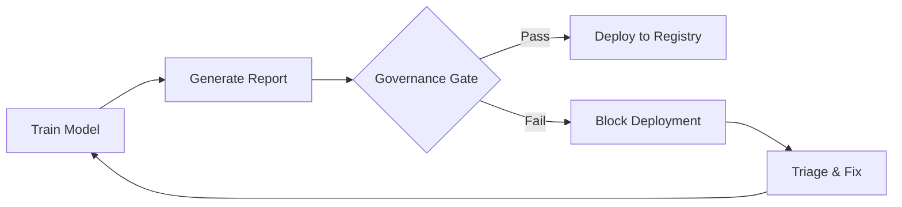
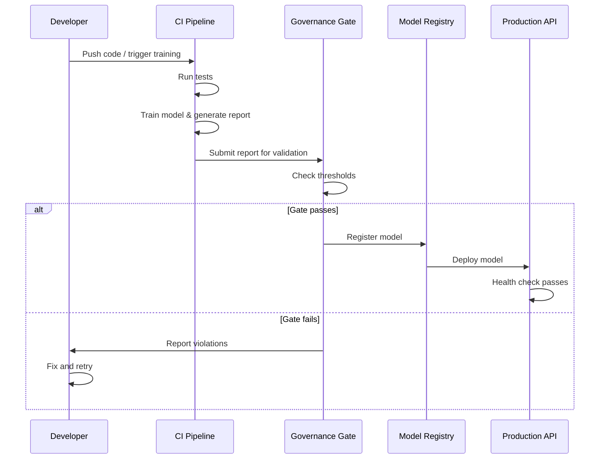

# Governance Gate Documentation

## Overview

This project implements **governance as code**: automated pre-deployment checks that validate model fairness and performance against configurable thresholds. No model can be deployed unless it passes all governance checks.

## Default Thresholds

The default thresholds are defined in `GateThresholds` (`src/fairness_project/governance/gate.py`):

| Threshold | Default Value | Description |
|-----------|---------------|-------------|
| `min_accuracy` | 0.80 | Minimum acceptable accuracy |
| `max_tpr_gap` | 0.05 | Maximum absolute TPR gap between groups |
| `min_disparate_impact` | 0.80 | Minimum disparate impact ratio (4/5ths rule) |
| `max_spd` | 0.10 | Maximum absolute statistical parity difference |

## Workflow



## CLI Usage

```bash
# Basic usage
python -m fairness_project.governance.gate --report path/to/report.json

# With custom thresholds
python -m fairness_project.governance.gate \
  --report path/to/report.json \
  --min-accuracy 0.85 \
  --max-tpr-gap 0.03 \
  --min-di 0.85 \
  --max-spd 0.08
```

**Exit codes**:
- `0`: Gate passed, model is safe to deploy
- `1`: Gate failed, one or more violations detected

## Programmatic Usage

```python
from fairness_project.governance.gate import check_gate, GateThresholds

report = {
    "metadata": {"run_id": "20240115_143022"},
    "results": {
        "metrics": {
            "accuracy": 0.862,
            "TPR_gap": -0.015,
            "DI": 0.455,
            "SPD": 0.158
        }
    }
}

# Check with default thresholds
result = check_gate(report)
print(f"Passed: {result.passed}")
print(f"Violations: {result.violations}")

# Check with custom thresholds
custom = GateThresholds(min_accuracy=0.85, max_tpr_gap=0.03)
result = check_gate(report, thresholds=custom)
```

## Output Format

**Passing gate**:
```
Governance Gate: PASSED
Metrics checked: {
  "accuracy": 0.862,
  "TPR_gap": -0.015,
  "DI": 0.455,
  "SPD": 0.158
}
```

**Failing gate**:
```
Governance Gate: FAILED
Metrics checked: {
  "accuracy": 0.50,
  "TPR_gap": 0.20,
  "DI": 0.40,
  "SPD": 0.30
}
Violations:
  - accuracy=0.5000 < min_accuracy=0.8
  - |TPR_gap|=0.2000 > max_tpr_gap=0.05
  - DI=0.4000 < min_disparate_impact=0.8
  - |SPD|=0.3000 > max_spd=0.1
```

## CI Integration

The governance gate runs as part of the CI pipeline in `.github/workflows/ci.yml`:

```yaml
governance-gate:
  name: Governance Gate
  runs-on: ubuntu-latest
  needs: test
  steps:
    - name: Run governance gate
      run: python -m fairness_project.governance.gate --report path/to/report.json
```

The CI job validates both that passing reports are accepted and failing reports are rejected.

## Report Format

The governance gate expects a JSON report with this structure (produced by `evaluation.report.generate_json_report`):

```json
{
  "metadata": {
    "run_id": "20240115_143022",
    "timestamp": "2024-01-15T14:30:22",
    "seed": 42,
    "model_type": "xgb"
  },
  "results": {
    "metrics": {
      "accuracy": 0.862,
      "precision": 0.746,
      "recall": 0.654,
      "f1": 0.697,
      "SPD": 0.158,
      "DI": 0.455,
      "TPR_gap": -0.015
    },
    "thresholds": {
      "privileged": 0.45,
      "unprivileged": 0.55
    }
  }
}
```

The gate checks: `accuracy`, `TPR_gap`, `DI`, and `SPD` from `results.metrics`. Missing metrics are skipped.

## Escalation Process

When the governance gate fails:

1. **Triage**: Review the specific violations in the gate output
2. **Diagnose**: Determine if the issue is in training data, model configuration, or thresholds
3. **Fix options**:
   - **Retrain**: Adjust model hyperparameters or training data
   - **Adjust thresholds**: If the current thresholds are too strict for the use case (requires documented justification)
   - **Override with approval**: In exceptional cases, a gate failure can be overridden with explicit sign-off from the responsible AI lead
4. **Document**: Record the decision and rationale in the run metadata

## End-to-End Sequence


