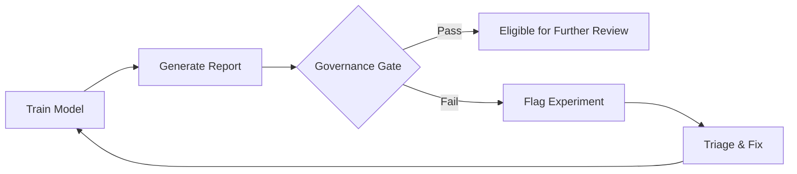
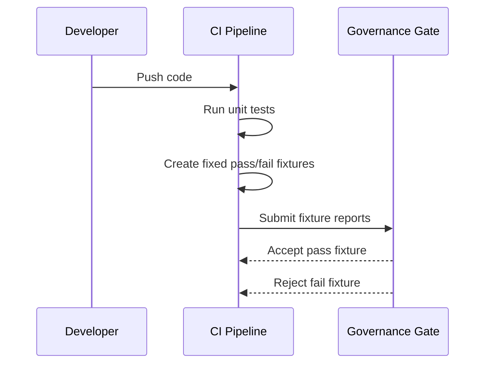

# Governance Gate Documentation

## Overview

This project demonstrates **governance as code** with automated checks against
configurable fairness and performance thresholds. The gate is an experimental
policy check, not evidence that a model is safe, lawful, or suitable for use.

## Default Thresholds

The default thresholds are defined in `GateThresholds` (`src/fairness_project/governance/gate.py`):

| Threshold | Default Value | Description |
|-----------|---------------|-------------|
| `min_accuracy` | 0.80 | Minimum acceptable accuracy |
| `max_tpr_gap` | 0.05 | Maximum absolute TPR gap between groups |
| `min_disparate_impact` | 0.80 | Minimum disparate impact ratio (4/5ths rule) |
| `max_spd` | 0.10 | Maximum absolute statistical parity difference |

## Workflow



## CLI Usage

```bash
# Basic usage
python -m fairness_project.governance.gate --report path/to/report.json

# With custom thresholds
python -m fairness_project.governance.gate \
  --report path/to/report.json \
  --min-accuracy 0.85 \
  --max-tpr-gap 0.03 \
  --min-di 0.85 \
  --max-spd 0.08
```

**Exit codes**:

- `0`: The supplied metrics passed the configured thresholds
- `1`: Gate failed, one or more violations detected

## Programmatic Usage

```python
from fairness_project.governance.gate import check_gate, GateThresholds

report = {
    "metadata": {"run_id": "20240115_143022"},
    "results": {
        "metrics": {
            "accuracy": 0.85,
            "TPR_gap": 0.03,
            "DI": 0.90,
            "SPD": 0.05
        }
    }
}

# Check with default thresholds
result = check_gate(report)
print(f"Passed: {result.passed}")
print(f"Violations: {result.violations}")

# Check with custom thresholds
custom = GateThresholds(min_accuracy=0.85, max_tpr_gap=0.03)
result = check_gate(report, thresholds=custom)
```

## Output Format

**Passing gate**:

```text
Governance Gate: PASSED
Metrics checked: {
  "accuracy": 0.85,
  "TPR_gap": 0.03,
  "DI": 0.90,
  "SPD": 0.05
}
```

**Failing gate**:

```text
Governance Gate: FAILED
Metrics checked: {
  "accuracy": 0.50,
  "TPR_gap": 0.20,
  "DI": 0.40,
  "SPD": 0.30
}
Violations:
  - accuracy=0.5000 < min_accuracy=0.8
  - |TPR_gap|=0.2000 > max_tpr_gap=0.05
  - DI=0.4000 < min_disparate_impact=0.8
  - |SPD|=0.3000 > max_spd=0.1
```

## CI Integration

The governance-gate job in `.github/workflows/ci.yml` creates fixed passing and
failing JSON fixtures, then checks that the CLI accepts and rejects them as
expected.

This verifies the threshold-checking code. The job does not train a model,
generate a live evaluation report, or approve an artifact for use.

## Report Format

The governance gate expects a JSON report with this structure. The
`evaluation.report.generate_json_report` helper can produce it, but the
documented leakage-free pipeline does not currently call that helper.

```json
{
  "metadata": {
    "run_id": "20240115_143022",
    "timestamp": "2024-01-15T14:30:22",
    "seed": 42,
    "model_type": "xgb"
  },
  "results": {
    "metrics": {
      "accuracy": 0.85,
      "precision": 0.75,
      "recall": 0.65,
      "f1": 0.70,
      "SPD": 0.05,
      "DI": 0.90,
      "TPR_gap": 0.03
    },
    "thresholds": {
      "privileged": 0.45,
      "unprivileged": 0.55
    }
  }
}
```

The gate requires `accuracy`, `TPR_gap`, `DI`, and `SPD` under
`results.metrics`. It fails closed if any required metric is missing.

## Escalation Process

When the governance gate fails:

1. **Triage**: Review the specific violations in the gate output
2. **Diagnose**: Determine if the issue is in training data, model configuration, or thresholds
3. **Fix options**:
   - **Retrain**: Adjust model hyperparameters or training data
   - **Revise the experiment**: Change thresholds only as an explicit,
     documented experimental configuration
4. **Document**: Record the decision and rationale in the run metadata

## Current CI Verification Sequence



Connecting a freshly trained model to this check would require an explicit
report-generation step plus provenance and review controls that are not yet
implemented.
